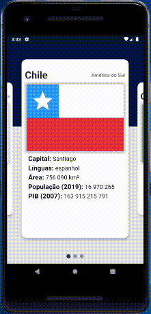

# Countries Flags

Small project done during Raro Academy course, as the first assignment (LevelUP1).

## About the application

This project consists of countries cards, that has countries information, such as: name, region, flag, capital, languages, and so on.

All the flags in the application where done with code.
 
This application were tested only on Android.

## To Do
- [ ] Add more flags
- [ ] Tests on iOS devices

## Extra Information

- The layout was inspired by the template made by [Anuar Bolatov](https://dribbble.com/bolatov) and available at [Dribbble](https://dribbble.com/shots/11569151-Electric-cars).
- Countries flags and information at [biblioteca.ibge](https://biblioteca.ibge.gov.br/visualizacao/livros/liv44152_cap5.pdf)

